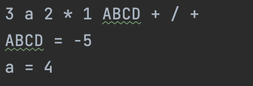

<h1 align="center">Evaluate Reverse Polish Notation</h1>

⬇️
  

<h2>Project description</h2>
This Java program evaluates postfix expressions written in Reverse Polish Notation (RPN) from a text file with support for variable substitution.

<h2>Features</h2>
<ul>
  <li>Allows for defining and using variables within RPN expressions.</li>
  <li>Reads the RPN expression and variable definitions from a file.</li>
  <li>Computes expressions provided in RPN format.</li>
</ul>

<h2>Technologies Used</h2>

<h2>Getting Started</h2>
To get a local copy up and running, follow these simple steps:
 

Clone the evaluate-rpn branch.  
Compile the program using javac: 
javac EvaluateRPN.java  
Run the compiled program using java: 
java EvaluateRPN

<h2>License</h2>
Distributed under the MIT License. See LICENSE for more information.
