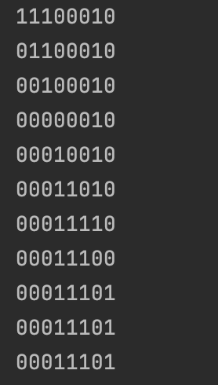
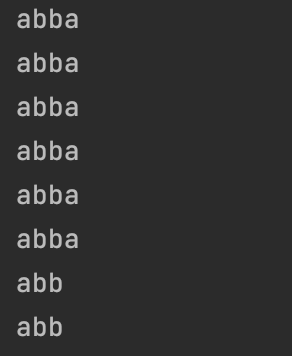
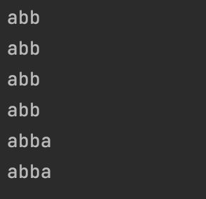
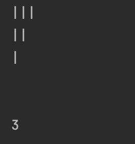

<h1 align="center">Turing Test</h1>

<h2>Project description</h2>
This Java program simulates a Turing machine, a theoretical computational model that manipulates symbols on an infinite tape according to a set of rules. The Turing machine in this project can be used to perform various operations on strings.
  
Key Concepts:  
<b>Alphabet:</b> The Turing machine uses a set of symbols to represent the tape's content. 
<b>States:</b> The machine operates in states, and transitions between them based on the current symbol and state. 
<b>Rules:</b> The transition rules dictate how the machine should behave when it encounters a specific symbol in a particular state.

<h2>Examples included</h2>
<h3>TuringTestBasic - Bitwise NOT</h3>
<b>Alphabet:</b> LinkedHashSet<Character> alphabet = new LinkedHashSet<>(Arrays.asList('0', '1', '_')); 
<b>States:</b> int[] states = {1, 2}; 
<b>Rules:</b> 
Rule[][] rules = new Rule[alphabet.size()][states.length]; 
&nbsp&nbsp    rules[2][0] = new Rule('_', Move.R, 1); 
&nbsp&nbsp    rules[0][1] = new Rule('1', Move.R, 1); 
&nbsp&nbsp    rules[1][1] = new Rule('0', Move.R, 1); 
&nbsp&nbsp    rules[2][1] = new Rule('_', Move.N, -1);   
<b>Input string: </b>"11100010" 
<b>Output:</b> 

<h3>TuringTestAdvanced</h3>
<b>Alphabet:</b> LinkedHashSet<Character> alphabet = new LinkedHashSet<>(Arrays.asList('a', 'b', '_','Н','|')); 
<b>States:</b> int[] states = {1,2,3,4};
<h4>Example 1 - Remove last symbol</h4>
<b>Rules:</b> 
Rule[][] rulesEx1 = new Rule[alphabet.size()][states.length]; 
&nbsp&nbsp    rulesEx1[2][0] = new Rule('_', Move.R, 1); 
&nbsp&nbsp    rulesEx1[0][1] = new Rule('a', Move.R, 1); 
&nbsp&nbsp    rulesEx1[1][1] = new Rule('b', Move.R, 1); 
&nbsp&nbsp    rulesEx1[2][1] = new Rule('_', Move.L, 0); 
&nbsp&nbsp    rulesEx1[0][0] = new Rule('_', Move.N, -1); 
&nbsp&nbsp    rulesEx1[1][0] = new Rule('_', Move.N, -1); 
<b>Input string: </b>"abba" 
<b>Output:</b>

<h4>Example 2 - Add last symbol</h4>
<b>Rules:</b>
Rule[][] rulesEx2 = new Rule[alphabet.size()][states.length]; 
&nbsp&nbsp    rulesEx2[2][0] = new Rule('_', Move.R, 1); 
&nbsp&nbsp    rulesEx2[2][1] = new Rule('_', Move.N, -1); 
&nbsp&nbsp    rulesEx2[0][1] = new Rule('a', Move.R, 2); //for first a 
&nbsp&nbsp    rulesEx2[1][1] = new Rule('b', Move.R, 3); //for first b 
&nbsp&nbsp    rulesEx2[0][2] = new Rule('a', Move.R, 2); 
&nbsp&nbsp    rulesEx2[1][2] = new Rule('b', Move.R, 2); 
&nbsp&nbsp    rulesEx2[2][2] = new Rule('a', Move.N, -1); 
&nbsp&nbsp    rulesEx2[0][3] = new Rule('a', Move.R, 3); 
&nbsp&nbsp    rulesEx2[1][3] = new Rule('b', Move.R, 3); 
&nbsp&nbsp    rulesEx2[2][3] = new Rule('b', Move.N, -1); 
<b>Input string: </b>"abb" 
<b>Output:</b>

<h4>Example 3 - Count symbols</h4>
<b>Rules:</b> 
Rule[][] rulesEx3 = new Rule[alphabet.size()][states.length]; 
&nbsp&nbsp    rulesEx3[2][0] = new Rule('_', Move.R, 1); 
&nbsp&nbsp    rulesEx3[2][1] = new Rule('_', Move.N, -1); 
&nbsp&nbsp    rulesEx3[4][1] = new Rule('_', Move.R, 1); 
<b>Input string: </b>"|||" 
<b>Output:</b>

<h2>Technologies Used</h2>

<h2>Getting Started</h2>
To get a local copy up and running, follow these simple steps:
 

Clone the turing-test branch.  
Compile the program using javac: 
javac ProgramName.java  
Run the compiled program using java: 
java ProgramName

<h2>License</h2>
Distributed under the MIT License. See LICENSE for more information.
