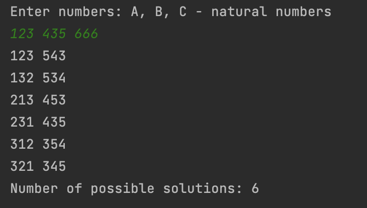

<h1 align="center">Sum of Permutations</h1>

<h2>Project description</h2>
This is a Java program that takes three natural numbers and then checks if any permutation of the first number, when added to any permutation of the second number, equals the third number. The program counts and displays the number of such valid permutations.

<h2>Features</h2>
<ul>
  <li>Input validation to ensure three natural numbers are entered.</li>
  <li>Generation of all permutations of the first number.</li>
  <li>For each permutation of the first number, generates all permutations of the second number.</li>
  <li>Checks if the sum of any permutation of the second number and the first number equals the third number.</li>
  <li>Displays the number of valid permutations found.</li>
</ul>

<h2>Technologies Used</h2>

<h2>Getting Started</h2>
To get a local copy up and running, follow these simple steps:
  

Clone the java-algorithmic-programs repository: 
git clone https://github.com/Yuliia-Kruta/java-algorithmic-programs.git  
Navigate to the project directory: 
cd java-algorithmic-programs  
Checkout the branch: 
git checkout permutation-sum  
Compile the program using javac: 
javac PermutationSum.java  
Run the compiled program using java: 
java PermutationSum

<h2>License</h2>
Distributed under the MIT License. See LICENSE for more information.
