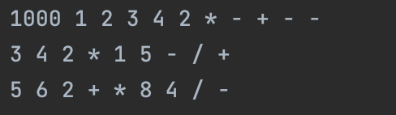

<h1 align="center">Reverse Polish Notation</h1>

⬇️
  

<h2>Project description</h2>
This program written in Java reads infix expressions (standard mathematical notation) from a text file, processes them using the Shunting Yard algorithm, and writes the converted expressions in <b>Reverse Polish Notation (RPN)</b> to an output file.

<h2>Features</h2>
<ul>
  <li>Reads mathematical expressions from an input file.</li>
  <li>Converts infix expressions to postfix notation and writes them to the output file.</li>
  <li>Handles parentheses and operators with correct precedence.</li>
</ul>

<h2>Technologies Used</h2>

<h2>Getting Started</h2>
To get a local copy up and running, follow these simple steps:
  

Clone the java-algorithmic-programs repository: 
git clone https://github.com/Yuliia-Kruta/java-algorithmic-programs.git  
Navigate to the project directory: 
cd java-algorithmic-programs  
Checkout the branch: 
git checkout reverse-polish-notation  
Open the project in your preferred IDE.

<h2>License</h2>
Distributed under the MIT License. See LICENSE for more information.
