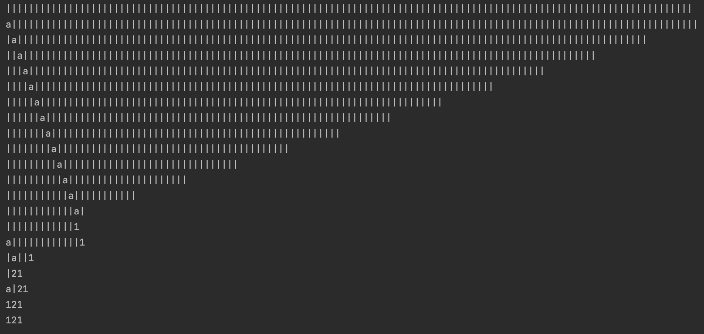
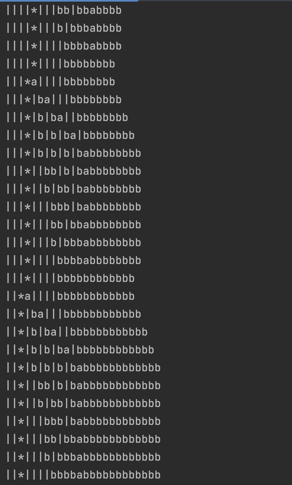
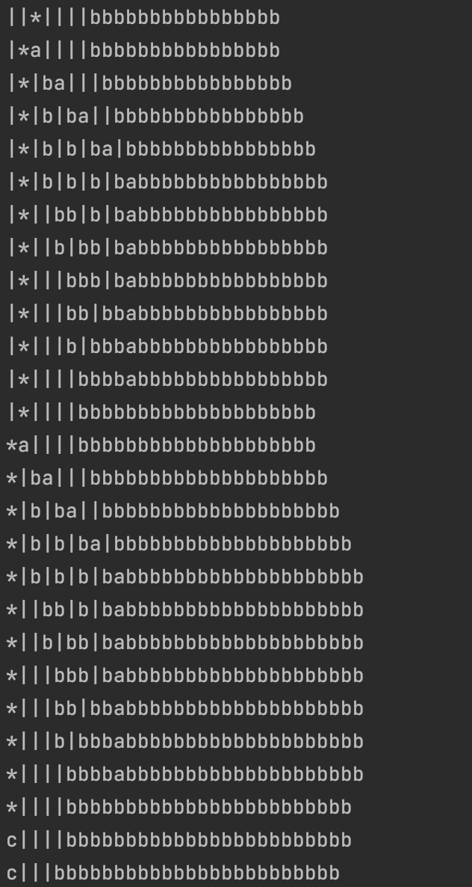
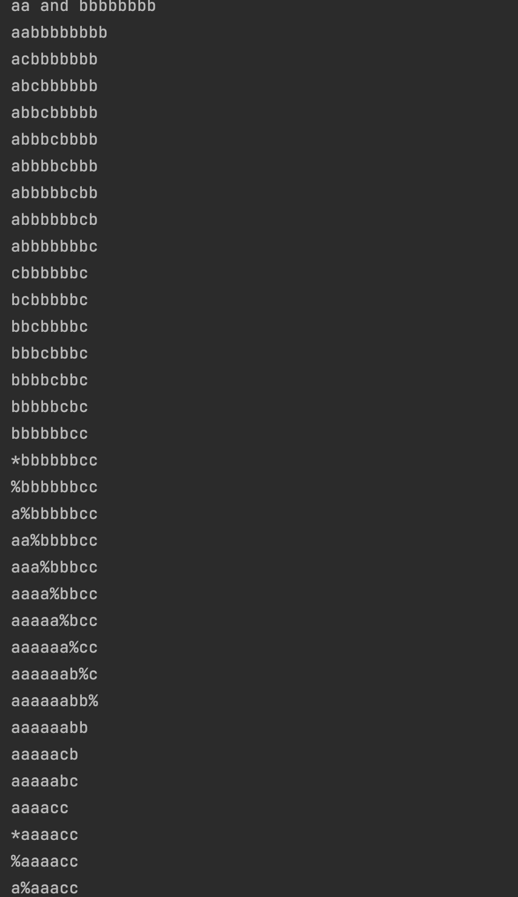

<h1 align="center">String Transformations</h1>
<h2>Branch description</h2>
This branch consists of a series of Java programs that perform various string transformations based on predefined sets of rules defined in a two-dimensional array called 'states'. Each program takes an input string and applies a series of transformations using regular expressions.  
Example of 'states' and input string: 
String[][] states = {{"a|", "|ba"},{"a", ""},{"b|", "|b"},{"|*", "*a"},{"*", "c"},{"c|", "c"},{"cb", "|c"},{"c", "."}}; 
String str = "||||*|||";  
The programs included are:  

1. **AddEndSymbol**: The program adds 1 more symbol to the end of the string.

2. **ClearEndSymbol**: The program removes the last symbol of the string.

3. **DuplicateString**: The program duplicates the input string.

4. **CountBars**: The program counts the number of vertical bars in the string and displays the count as a decimal.

5. **CalcExpression**: The program calculates the expression within the string.

6. **CalcMultiplication**: The program calculates a simple multiplication expression.

7. **CalcMultiplicationExpr**: The program calculates a more advanced multiplication expression. 

Images order: 
1  2 
3  4

9. **DivideBy3Quotient**: A program finds a quotient of the division by 3.

10. **FindRemainder**: A program finds the remainder of a division.

   

11. **GCD**: A program finds the greatest common divisor of 2 numbers.

     

<h2>Technologies Used</h2>

<h2>Getting Started</h2>
To get a local copy up and running, follow these simple steps:
  

Clone the java-algorithmic-programs repository: 
git clone https://github.com/Yuliia-Kruta/java-algorithmic-programs.git  
Navigate to the project directory: 
cd java-algorithmic-programs  
Checkout the branch: 
git checkout string-transformations  
Open the project in your preferred IDE.

<h2>License</h2>
Distributed under the MIT License. See LICENSE for more information.
